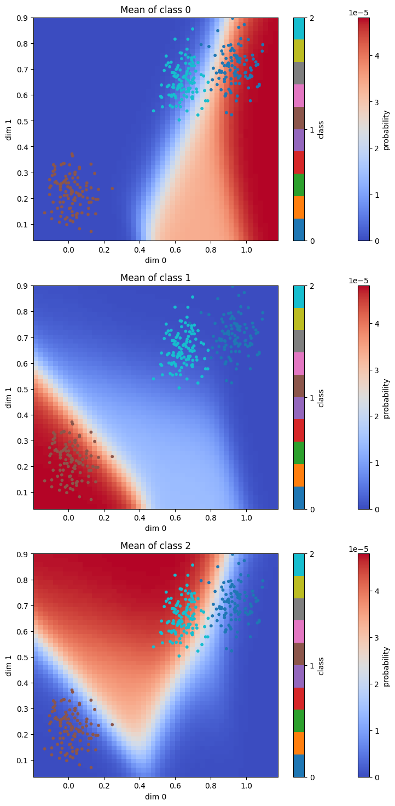
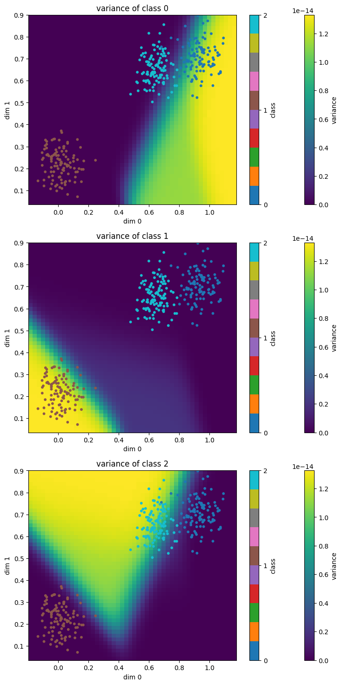
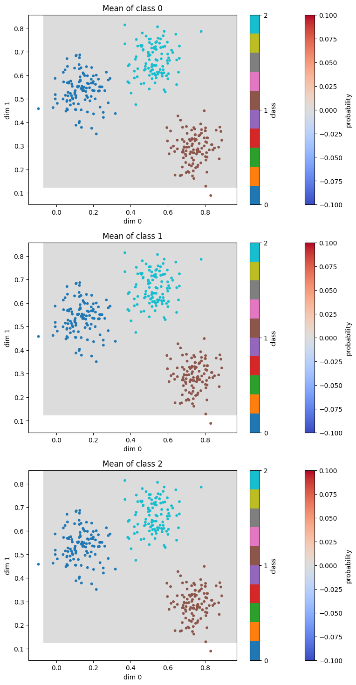

# Bayesian Inference of Multiclass Classification

학번: 2019017183

이름: 지영채

코드: [https://github.com/litcoderr/bayesian_inference](https://github.com/litcoderr/bayesian_inference)

    해당 repository 의 `gaussian.ipynb` 를 이용해 gaussian inference 를 실행할 수 있습니다.

---

# Problem Introduction

Multiclass Classification 이란 입력 값에 따라 3개 이상의 그룹으로 분류하는 task 입니다. 편의를 위해 지금부터, 하나의 그룹을 class 라고 부르도록 하겠습니다. 일반적으로 3개 이상의 class 로 구성되어 있는 현실세계 데이터가 많다보니, 2개의 class에 대해서만 probability density 를 예측하는 logistic regression 에서 발전시킬 필요가 있다고 생각했습니다.

학습을 위한 data 를 다음과 같은 수학 기호로 표기하겠습니다.

$$
X=\begin{pmatrix}
x_1 \cr
... \cr
x_N \cr
\end{pmatrix} \quad

Y=\begin{pmatrix}
y_1 \cr
... \cr
y_N \cr
\end{pmatrix} \quad

where \quad
x_i \in {\rm I\!R}^D \quad
c_i \in \{c_1 ... c_M\}  \quad
$$


$$
N: number \ of \ data \\
D: dimension \ of \ input \ space \\
M: number \ of \ class \\
c_i: i^{th} class
$$

# Probabilistic Model

input data 에 대해 모든 class 들에 대한 확률을 categorical distribution 으로 예측하기 위해 softmax 모델을 사용했습니다. 수식은 다음과 같습니다.

$$
P(y=c_i|x W b) = \frac{exp({W_i}^T x + b_i)}{\sum_{j=1}^M exp({W_j}^T x + b_j)} \quad where\\
$$
$$
W=\begin{pmatrix}
W_1 ... W_M
\end{pmatrix}_{{\rm I\!R}^{D*M}} \\

b=\begin{pmatrix}
b_1 \cr
... \cr
b_M \cr
\end{pmatrix}_{{\rm I\!R}^{M}} \\
$$

# Bayesian Extension

## Prior Distribution

Model 과 training data 를 이용해 bayesian inference 를 하기 위해, bayesian extension 을 진행했습니다. 즉, W 와 b 에 대해 prior distribution 을 정의했습니다.

$$
W \stackrel{}{\sim} N(mu, sigma) \\
b \stackrel{}{\sim} N(mu, sigma) \\
$$

## Bayesian Inference
위 prior distribution 을 이용해 다음과 같이 bayesian inference 를 진행할 수 있습니다.

$$
P(y=c_i|x X Y) = \int \int P(y=c_i|xWb)P(Wb|XY)  dw db
$$

## Posterior Distribution
이때 posterior distribution 은 다음과 같습니다.

$$
P(Wb|XY) = \frac{P(Y|XWb)P(Wb)}{P(XY)}
$$

## Estimation using Posterior Sampling

Joint distribution 의 closed form 을 구하기 어렵기 때문에, W 와 b 에 대해 sampling 후 joint distribution 을 근사하는 방법론을 택했습니다. 총 K 번 sampling 을 한다고 가정했을 시, k 번째 joint distribution 은 다음과 같습니다.

$$
P_k(y=c_i|xXY) \propto P(y=c_i|x W_k b_k)P(Y|X W_k b_k)
$$
$$
W_k = k^{th} \ sampled \ W \\
b_k = k^{th} \ sampled \ b \\
$$

이때 sampling 된 set 이 다음과 같을 때,

$$
S = \{ P_1(y=c_i|xXY), ... , P_K(y=c_i|xXY) \}
$$

아래와 같이 joint probability distribution 을 estimate 할 수 있습니다.

$$
Exp(y=c_i|xXY) \approx mean(S / sum(S)) \\
Var(y=c_i|xXY) \approx variance(S/sum(S))
$$

S 는 normalize 가 안된 set 이기 때문에, set 의 총합으로 나눠줘야 probability density function 의 형태로 나옵니다.

# Implementation

Sampling method 는 sample 갯수를 최대한 많이 늘리는 것이 실제 distribution 에 정확히 estimate 하는 방법입니다. 하지만 cpu 로 matrix 연산을 처리하는 것은 매우 느립니다. GPU 의 도움을 받아 병렬로 sample 에 대해 계산할 수 있도록 구글사가 개발한 `JAX` 를 사용했습니다. `JAX` 는 high-performace array computing 라이브러리로, `numpy` 와 매우 유사하며, `@jit` decorator 를 이용해 일반 파이선 함수에 대한 gpu 최적화가 간편합니다.

## Environment

해당 repository 에 docker 폴더가 존재합니다. 내부의 `Dockerfile` 을 이용해 개발환경을 재현할 수 있습니다. CUDA Version 12.0 이상 호환되는 GPU 를 필요로 합니다. (Google Colab 가능)

## Dataset

손쉽게 classification 데이터를 생성하고 테스트를 해보기 위해, gaussian dataset 을 구현했습니다. `M` argument 로 class 의 갯수를 설정할 수 있으며, mu 를 uniform 하게 sampling 하여 mu 를 중심으로 normal distribution 에서 각 class 별 data point 를 sampling 하는 방식입니다.

`data/gaussian.py` 에 구현되어 있습니다.

```python
import numpy as np
from sklearn.model_selection import train_test_split


class GaussianDataset:
    def __init__(self, N, M, D=2):
        """
        N: number of data point
        M: number of classes
        D: input space dimension
        """
        self.M = M

        # sample mu of each class
        self.mu = np.random.uniform(low=0, high=1, size=(M, D))  # [M, D]

        self.Y = np.random.randint(low=0, high=M, size=(N)) # [N]
        self.X = np.stack([np.random.normal(self.mu[c], 0.07) for c in self.Y], axis=0) # [N, D]

        self.X_train, self.X_test, self.Y_train, self.Y_test \
            = train_test_split(self.X, self.Y, test_size=0.33, random_state=42)
    
    def get_nclasses(self):
        return self.M

```

## Model
`model/softmax.py` 에 구현되어 있습니다.

### Softmax
$$
P(y=c_i|x W b) = \frac{exp({W_i}^T x + b_i)}{\sum_{j=1}^M exp({W_j}^T x + b_j)} 
$$

다음 수식과 같이 input 에 대해 categorical distribution 을 반환합니다.

```python
@jit
def model(X: jnp.array, W: jnp.array, b: jnp.array) -> jnp.array:
    """
    P(Y|X W b)

    Args:
        X: [N, D]
        W: [B, D, M]
        b: [B, M]

    Returns:
        [B, N, M]
    """
    non_linear = jnp.exp(jnp.matmul(X, W) + jnp.expand_dims(b, axis=1))  # [B, N, M]
    denominator = jnp.expand_dims(jnp.sum(non_linear, axis=2), axis=2)  # [B, N, 1]
    return non_linear / denominator  # [B, N, M]
```

## Sampling Weight and Bias

Weight 와 Bias 를 각각의 prior distribution 에서 sampling 하는 함수입니다. mu 와 sigma 를 통해 prior distribution 을 정의해주며, B개 (sample 수) 만큼 sampling 합니다.

```python
def sample_theta(B: int, D: int, M: int, mu: float = 0, sigma: float = 1) -> Tuple[np.array, np.array]:
    """
    Samples W and b\n
    W ~ N(mu, sigma)\n
    b ~ N(mu, sigma)\n

    Args:
        B: batch size
        D: input space dimension
        M: number of class
        mu: mu of prior distribution
        sigma: sigma of prior distribution
    Returns:
        sampled W [B, D, M] and b [B, M]
    """
    W = np.random.normal(mu, sigma, size=(B, D, M))
    b = np.random.normal(mu, sigma, size=(B, M))
    return W, b
```

## Sampling Posterior

Sampling 된 weight 와 bias 를 통해 posterior 를 구하는 함수입니다. 필요한 proportionate 한 prior distribution 은 다음과 같습니다.

$$
P(Y|X W_k b_k) = P(y_1|x_1 W_k b_k) * P(y_2|y_2 W_k b_k) * ... * P(y_N|x_N W_k b_k)
$$

```python
@jit
def sampled_posterior(X: jnp.array, Y: jnp.array, W: jnp.array, b: jnp.array) -> jnp.array:
    """
    proportionate to P(W b | X Y)\n
    P(Y|X W b) = P(y_1|x_1 W b) * ... * P(y_N|x_N W b)\n

    Args:
        X: [N, D] train input data
        Y: [N] train output data
        W: [B, D, M] sampled weight
        b: [B, M] sampled bias
    
    Returns:
        [B] proportionate posterior
    """
    # predicted distribution of Y given X W and b
    predicted = model(X, W, b)  # [B, N, M]
    predicted = predicted[:, jnp.arange(predicted.shape[1]), Y]  # [B, N]
    return jnp.prod(predicted, axis=1)  # [B]
```

## Estimating Joint Probability Density Function

Sampling 된 Weight 와 Bias 를 이용해 joint probability density function 을 근사하는 함수입니다. 반환값은 tuple 로, `dist` 와 `sample_dist` 가 있습니다. `dist` 는 예측한 joint pdf 이며, `sample_dist` 는 각 sample 된 Weight 와 Bias 가 주어졌을 때의 pdf 입니다.

```python
@jit
def infer_with_sampled(x: jnp.array, X: jnp.array, Y: jnp.array, W: jnp.array, b: jnp.array) -> jnp.array:
    """
    Bayesian Inference of softmax

    Args:
        x: [N_test, D] to be inferred input data
        X: [N_train, D] train input data
        Y: [N_train] train output data
        W: [B, D, M] sampled weight
        b: [B, M] sampled bias

    Returns:
        (dist, sample_dist)
        dist: [N_test, M] joint predicted distribution
        sample_dist: [N_test, B, M] predicted distribution for every sample
    """

    # compute sampled posterior distribution given sampled thetas
    posterior = sampled_posterior(X, Y, W, b)  # [B]

    # compute distribution for every sampled W
    prob_w = model(x, W, b)  # [B, N_test, M]

    # compute non-normalized probability distribution
    sample_dist = jnp.transpose(prob_w * posterior[:, None, None], axes=(1, 0, 2))  # [N_test, B, M]
    dist = jnp.sum(sample_dist, axis=1) # [N_test, M]

    # normalize sample distribution
    sample_denominator = jnp.clip(jnp.sum(sample_dist, axis=2), a_min=jnp.finfo(jnp.float32).tiny) # [N_test, B]
    sample_dist /= sample_denominator[:, :, None]  # [N_test, B, M]

    # normalize distribution
    dist_denominator = jnp.clip(jnp.sum(dist, axis=1), a_min=jnp.finfo(jnp.float32).tiny) # [N_test]
    dist /= dist_denominator[:, None]  # [N_test, M]

    return dist, sample_dist
```

## Evaluation Metric

Recall@1 (가장 높은 probability 를 가지는 class 가 정답일 확률) 을 사용하여 정확도를 측정했습니다. 다음과 같은 함수를 사용해 recall 의 범위를 설정해 정확도를 측정할 수 있습니다.

```python
def recall(pred_dist: np.array, gt: np.array, r: int = 1):
    """
    Args:
        pred_dist: [N, M]
        gt: [N]
        r: recall value
    
    Returns:
        recall percentage
    """
    indices = np.argsort(-pred_dist)
    top_r_indices = indices[:, :r]

    is_in_top_r = np.any(top_r_indices == gt[:, np.newaxis], axis=1)

    return np.mean(is_in_top_r) * 100
```

# Result
- Dataset 에 대해서 70% 는 학습, 30% 는 evaluation 에 사용했습니다.
- sampling 갯수는 100000 개 입니다.
- W 와 b 의 prior distribution 은 N(0, 10) 입니다.

다음과 같이 number of class 가 3 인 경우에 대해 96% 의 확률로 정확히 예측하는 것을 볼 수 있습니다. 또한 class 0 와 class 2 가 붙어있음에도 불구하고, 문제없이 classify 하는 것을 볼 수 있습니다.


| Recall @ 1      |
| ----------- |
| 96.9      |




# Pitfall

Weight 와 bias 를 prior 에서 sampling 하다보니, grouping 이 잘 되어있는 쉬운 underlying distribution 임에도 불구하고 prior 가 잘못 설정되어 있으면 다음과 같이 확률이 0 으로 수렴하는 문제가 발생합니다.



따라서 최대한 넓은 범위의 weight 와 bias 를 보기 위해 sigma 를 1 이 아닌 10 으로 설정했습니다.

# Last Remark

Bayesian Inference 의 장점은, data 갯수가 부족함에도 불구하고 모델링이 가능하다는 점이 있습니다. 또한 예측값에 대한 불확실성을 알 수 있습니다. 하지만 Pitfall 섹션에서도 언급했던 바와 같이 prior distribution 을 잘 설정하는게 중요해 보입니다. 이를 개선하기 위해 다음과 같은 방법을 생각해 보았습니다.

1. frequentist 의 방식을 이용해 weight 와 bias 의 mean 을 예측한다.
2. 1번에서 도출한 mean 을 이용해 prior 를 설정후 bayesian inference 를 수행한다.

위와 같은 방법을 사용할 경우 보다 정확하게 prior 를 설정함으로서 pitfall 을 방지할 수 있고, bayesian inference 가 주는 장점도 얻을 수 있다고 생각합니다.

또한 이번 프로젝트에서 class 의 갯수가 4 이상으로 늘어나거나, input dimension 이 커지는 경우, fitting 을 잘하지 못하는 것을 발견했습니다. 이는 softmax 를 적용하기 전 linear 한 함수로 모델링을 하여 non-linear 한 데이터에 대해 부정확하다고 생각합니다. 따라서 future works 로는, non-linearity 와 layer 를 추가하여 bayesian inference 를 진행한다면, 성공적으로 fitting 할 수 있을 것이라고 생각합니다.

이번 한 학기동안 많은 것을 배워갈 수 있어 매우 행복했습니다. 감사합니다.
